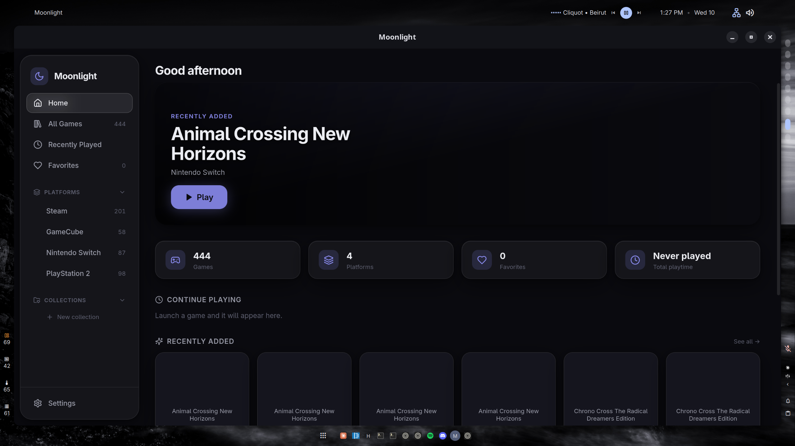
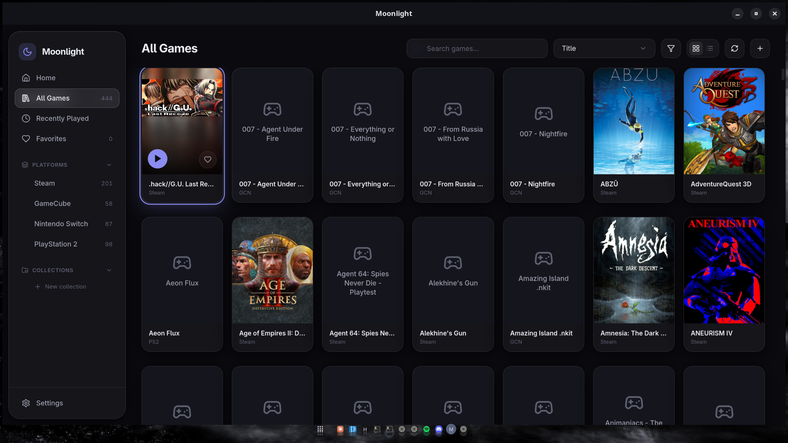
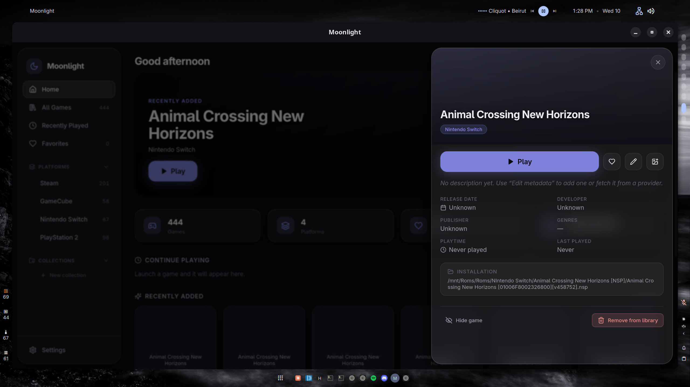

# Moonlight

A polished, local-first game library for your desktop — Steam, ROMs, emulators and native games in one
dark, cinematic interface. Built with Tauri 2, Rust, React and SQLite.



Moonlight is inspired by Pegasus, LaunchBox, Playnite and EmulationStation DE: it discovers games,
organizes them into a unified library, launches them through their associated emulator or platform,
tracks play sessions, and manages metadata and artwork — entirely offline, with no account, no
telemetry and no cloud.

## Features

- **Unified library** — Steam imports, ROM directory scans, and manually added games, organized by
  platform with grid and list views, instant search, filtering (platform, source, genre, favorites,
  installed, hidden, collections) and eight sort modes.
- **Real launching** — structured process execution (never an unsafe shell), per-emulator command
  templates (`{executable} -L {corePath} {gamePath}`), child-process supervision, play-session
  recording, playtime accumulation and "Recently Played".
- **Steam** — discovers installations and library folders from `libraryfolders.vdf` /
  `appmanifest_*.acf`, imports installed games with the Steam client's cached artwork, launches via
  `steam://rungameid/…`. No credentials required.
- **RetroArch** — executable auto-detection, libretro core discovery with per-platform core mapping,
  template-driven launches.
- **Standalone emulators** — presets for Dolphin, PCSX2, Ryujinx, PPSSPP and DuckStation, plus fully
  custom emulators with editable templates, working directories and environment variables. Guided
  7-step connect wizard with test-launch.
- **Idempotent scanning** — re-scans never duplicate games, missing files are flagged, moved files are
  reconnected by name + size, and user edits/favorites/artwork always survive. Progress, cancellation
  and result reports in the UI.
- **Metadata & artwork** — provider abstraction with SteamGridDB included (API key optional), match
  confidence scoring, review UI for ambiguous matches, per-field locking against automatic updates,
  provider snapshot restore, local file import, URL import, and per-slot selection (box art,
  background, logo, banner, icon, screenshot).
- **Console feel** — glassmorphism design, ambient artwork backdrop, smooth animations (with reduced
  motion support), full keyboard navigation and game-controller navigation (d-pad/stick + A/B/Y/Start).
- **Local-first** — everything lives in a SQLite database in your app-data directory. One-click
  database backup and JSON library export.

## Requirements

- [Rust](https://rustup.rs) (stable)
- [Node.js](https://nodejs.org) ≥ 20 and [pnpm](https://pnpm.io)
- Linux: `webkit2gtk-4.1`, `gtk3`, `libsoup3` (see [Tauri prerequisites](https://tauri.app/start/prerequisites/))

## Development

```sh
pnpm install        # frontend dependencies
pnpm tauri dev      # run the app with hot reload
```

The SQLite database, artwork and logs live in the per-user app-data directory
(`~/.local/share/dev.moonlight.app` on Linux). Delete it to start fresh.

### Quality gates

```sh
pnpm typecheck            # TypeScript strict mode
pnpm lint                 # ESLint
pnpm test                 # vitest (sorting/filtering)
pnpm build                # production frontend build
cargo fmt --check         # in src-tauri/
cargo clippy --all-targets
cargo test                # migrations, sync, merge rules, launching, sessions…
pnpm tauri build          # production desktop bundle
```

## Architecture

```
src/                      React + TypeScript (strict)
  lib/                    typed Tauri API wrappers, pure sort/filter logic, gamepad input
  stores/                 zustand stores: library, ui, settings, scan
  components/             design system (ui/), layout, library views, dialogs
  screens/                Onboarding, Home, Library, Settings
src-tauri/src/
  domain.rs               serde domain models (camelCase over IPC)
  db/                     connection, migrations (db/migrations/*.sql), repositories
  catalog.rs              built-in platforms + emulator presets
  scan.rs                 idempotent ROM/Steam synchronization
  steam.rs                VDF/ACF parsing, library + artwork discovery
  retroarch.rs            core detection and classification
  launch.rs               structured command building + process supervision
  metadata/               provider trait, SteamGridDB, cache, confidence scoring
  artwork_store.rs        local imports and URL downloads
  commands/               thin #[tauri::command] wrappers per area
```

Key boundaries:

- **DB rows ↔ domain models** are mapped in `db/repo/*`; commands never touch SQL outside
  repositories, and React components never call `invoke` directly — they use `src/lib/api.ts`.
- **Business logic stays out of React.** Filtering/sorting are pure functions (`src/lib/sort.ts`,
  unit-tested); scanning, launching and metadata merging live in Rust.
- **Scans and launches run off the UI thread** (`spawn_blocking` / dedicated threads) and report via
  Tauri events (`scan-progress`, `scan-complete`, `session-started`, `session-ended`).

### Extending

- [Adding an emulator adapter](docs/adding-an-emulator-adapter.md)
- [Adding a metadata provider](docs/adding-a-metadata-provider.md)

## Controls

| Action | Keyboard | Controller |
| --- | --- | --- |
| Move selection | Arrow keys | D-pad / left stick |
| Open details | Enter | A |
| Back / close | Escape | B |
| Toggle favorite | F | Y |
| Launch game | L | Start |
| Search | `/` or Ctrl+F | — |

## Screenshots

| | |
| --- | --- |
|  |  |
|  |  |

## Status

Implemented: onboarding, home (continue playing / recently added / favorites / platform shortcuts /
stats), all library views, game details drawer, metadata editor with field locking, artwork selector,
manual game import, emulator wizard with presets and test-launch, RetroArch core mapping, Steam import,
idempotent scanning with progress/cancel/reports, process launching with play sessions, collections,
settings (10 sections), diagnostics with log viewer, database backup and JSON export, keyboard +
controller navigation, reduced-motion and UI-scale options.

Remaining non-critical improvements:

- IGDB / ScreenScraper providers (the provider trait, settings flow and review UI are in place)
- ROM hash-based matching for more reliable provider lookups
- Drag-and-drop collection management and sidebar reordering
- Import of Playnite/LaunchBox libraries
- Localization, theming beyond the accent palette, per-platform view preferences
- Flatpak/AppImage CI packaging
